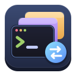
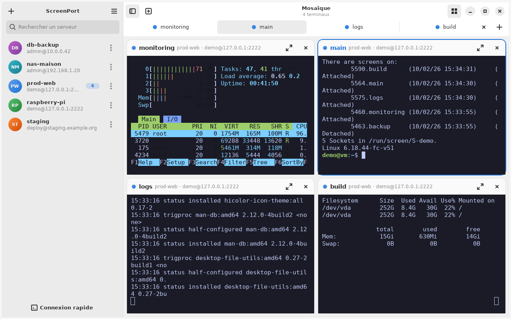
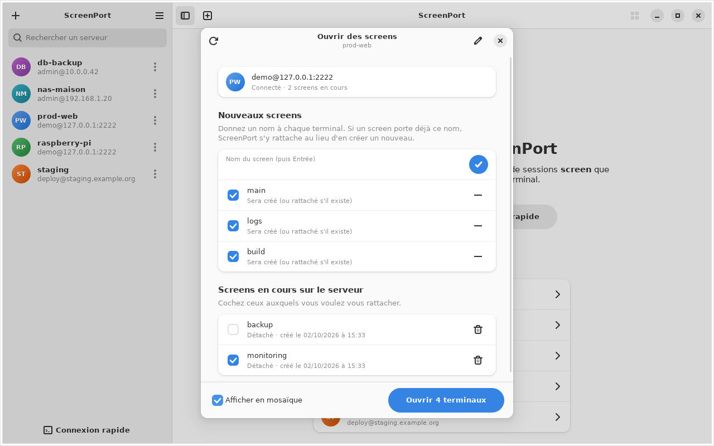
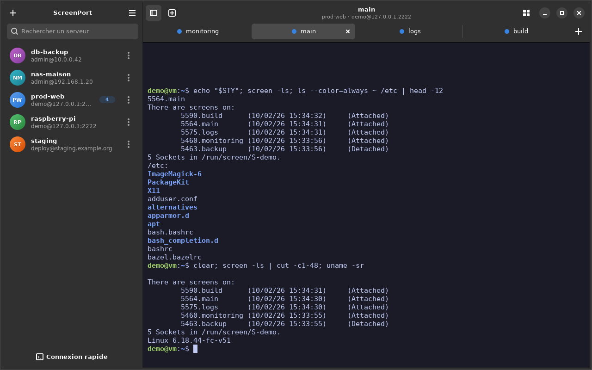
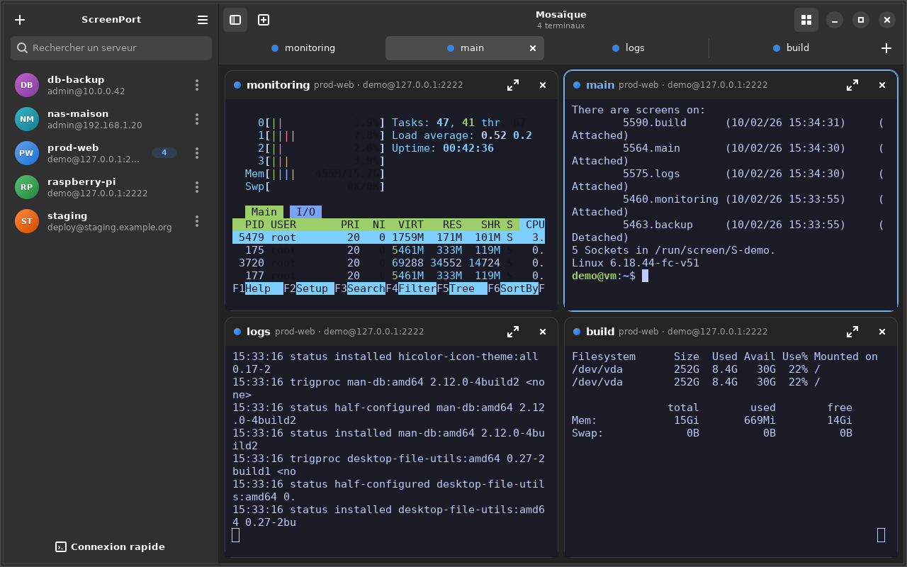
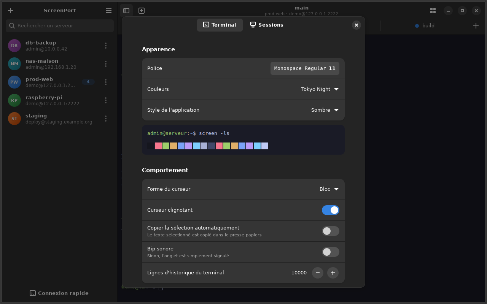

<p align="center">
  
</p>

<h1 align="center">ScreenPort</h1>

<p align="center">
  Client SSH graphique pour Linux : ouvrez plusieurs terminaux en même temps,<br>
  chacun sur une session <b>GNU screen</b> au nom de votre choix.
</p>



## Le principe

1. Vous enregistrez un serveur : **adresse, utilisateur, port** et **mot de passe** ou **clé privée** (ou votre agent SSH).
2. Vous choisissez les noms des terminaux à ouvrir : `main`, `logs`, `build`…
3. Pour chaque nom, ScreenPort se connecte et :
   - **crée le screen** sur le serveur s'il n'existe pas ;
   - **s'y rattache directement** s'il existe déjà.

Fermer un onglet ne tue rien : le screen continue de tourner sur le serveur et vous
le retrouvez tel quel à la prochaine ouverture (y compris après une coupure réseau ou
un redémarrage de votre PC).

## Fonctionnalités

- **Serveurs enregistrés** avec couleur, recherche et « screens favoris » ouvrables en un clic.
- **Connexion rapide** : collez `utilisateur@hôte:port` et c'est parti.
- **Authentification** par mot de passe, clé privée (avec ou sans phrase de passe) ou agent SSH.
  Les secrets sont rangés dans le **trousseau du système** (GNOME Keyring, KWallet…).
- **Ouverture groupée** : la fenêtre « Ouvrir des screens » liste les screens existants
  (attachés/détachés, date de création) et permet d'en créer plusieurs d'un coup.
- **Onglets** colorés par serveur, et **vue mosaïque** pour voir tous les terminaux côte à côte.
- **Gestion des screens** : renommer, terminer, rouvrir un onglet fermé.
- **Une seule authentification par serveur** : les terminaux suivants réutilisent la
  connexion SSH (multiplexage) et s'ouvrent instantanément.
- **Reconnexion automatique** après une coupure, et **réouverture des onglets** au démarrage.
- **Terminal confortable** : 10 thèmes de couleurs, zoom, copier/coller, liens cliquables (Ctrl+clic).
- Import des hôtes de `~/.ssh/config`, mode clair/sombre, raccourcis clavier.

| Ouvrir des screens | Onglets (thème sombre) |
| --- | --- |
|  |  |
| **Mosaïque (thème sombre)** | **Préférences** |
|  |  |

## Installation (.deb)

Distributions prises en charge : **Ubuntu 24.04+**, **Debian 13+**, **Linux Mint 22+**,
Pop!_OS 24.04+ et dérivées (libadwaita 1.5 minimum).

1. Récupérez `screenport_1.0.0_all.deb` dans les
   [Releases](https://github.com/Wyze3306/ScreenPort/releases) ou dans les artefacts de
   l'onglet *Actions* (workflow « Paquet .deb »).
2. Installez-le (apt installe automatiquement les dépendances) :

   ```bash
   sudo apt install ./screenport_1.0.0_all.deb
   ```

3. Lancez **ScreenPort** depuis le menu des applications, ou `screenport` dans un terminal.

Sur le **serveur**, il suffit d'avoir `screen` (`sudo apt install screen`). S'il manque,
ScreenPort le signale et propose d'ouvrir un shell normal.

Désinstallation : `sudo apt remove screenport`.

## Construire le paquet soi-même

```bash
git clone https://github.com/Wyze3306/ScreenPort.git
cd ScreenPort
make test   # tests unitaires
make deb    # -> dist/screenport_1.0.0_all.deb
```

Seuls `dpkg-deb` et `python3` sont nécessaires pour construire le paquet.
Pour lancer l'application directement depuis les sources :

```bash
make deps   # installe GTK 4, libadwaita, VTE…
make run
```

## Utilisation en ligne de commande

```bash
screenport --open prod-web                          # ouvre la fenêtre « Ouvrir des screens »
screenport --open prod-web --screen main --screen logs   # ouvre directement ces deux screens
```

`--open` accepte le nom affiché du serveur ou `utilisateur@hôte`.

## Raccourcis clavier

| Raccourci | Action |
| --- | --- |
| Ctrl+Maj+T | Nouveau screen sur le serveur courant |
| Ctrl+Maj+O | Ouvrir des screens sur le serveur courant |
| Ctrl+Maj+R | Renommer le screen |
| Ctrl+Maj+W | Fermer l'onglet (le screen continue) |
| Ctrl+Maj+M | Vue mosaïque |
| Ctrl+Maj+N / Ctrl+Maj+K | Ajouter un serveur / connexion rapide |
| Ctrl+Maj+C / Ctrl+Maj+V | Copier / coller |
| Ctrl+Page suiv. / préc., Alt+1…9 | Changer d'onglet |
| Ctrl+plus / Ctrl+moins / Ctrl+0 | Zoom du texte |
| Ctrl+Maj+B | Afficher/masquer la liste des serveurs |
| F11 | Plein écran |

Astuce screen : `Ctrl+a d` détache le screen, `Ctrl+a Échap` permet de remonter dans l'historique.

## Comment ça marche

- Chaque onglet est un vrai terminal (VTE) qui lance le client `ssh` du système : vos
  options de `~/.ssh/config` (ProxyJump, etc.) s'appliquent.
- La commande envoyée au serveur cherche une session screen portant exactement ce nom :
  `screen -d -r` (ou `screen -x` en mode partagé) si elle existe, sinon `screen -S nom`.
- Les noms de screen sont limités à `A-Z a-z 0-9 - _` (les espaces deviennent des tirets),
  ce qui évite tout problème d'échappement côté serveur.
- Le mot de passe est transmis à `ssh` via un programme `SSH_ASKPASS` interne, jamais
  écrit sur le disque en clair ni passé en argument. Les nouvelles clés d'hôte sont
  acceptées à la première connexion (`accept-new`) ; une clé **modifiée** est toujours refusée.
- Configuration : `~/.config/screenport/` (`servers.json`, `settings.json`). Si aucun
  trousseau n'est disponible, les secrets vont dans `secrets.json` (permissions 600).

## Licence

[MIT](LICENSE)
